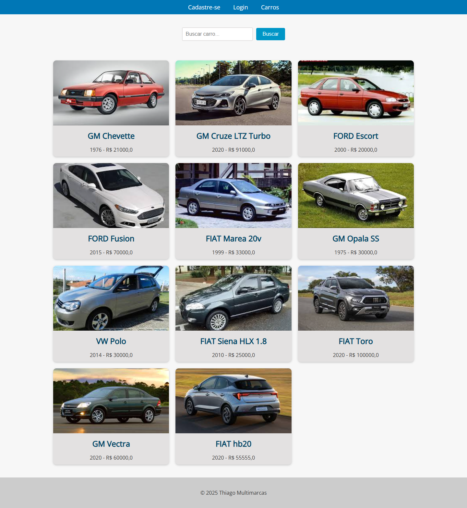
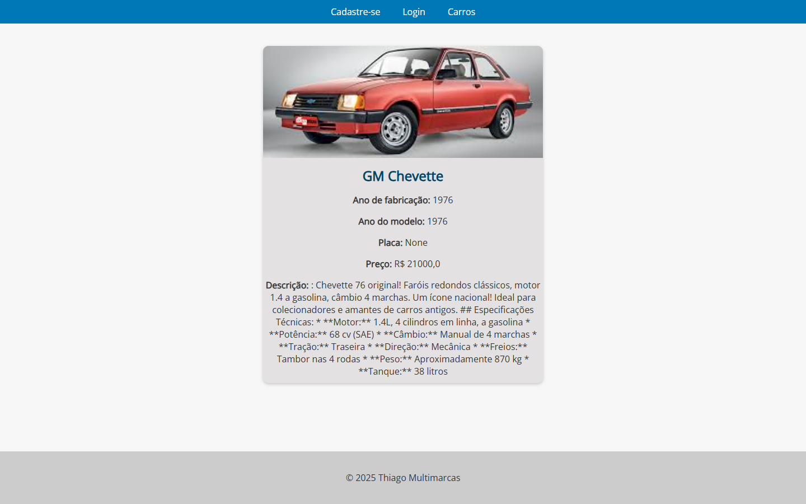
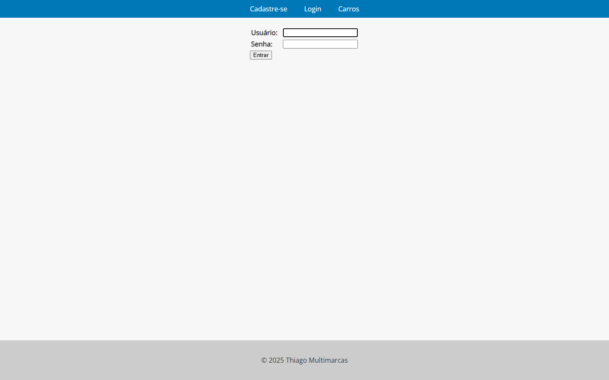

# Carros


Aplicação web para catálogo e venda de carros, desenvolvida com Django. Permite listar e gerenciar carros e marcas, com autenticação de usuários, inventário automático e geração da descrição dos veículos com IA (OpenAI, Gemini ou MistralAI).



*Catálogo de carros — listagem com busca por modelo.*

## Sumário

- [Visão geral](#visão-geral)
- [Telas do projeto](#telas-do-projeto)
- [Funcionalidades](#funcionalidades)
- [Tecnologias](#tecnologias)
- [Estrutura do projeto](#estrutura-do-projeto)
- [Instalação e execução](#instalação-e-execução)
- [Variáveis de ambiente](#variáveis-de-ambiente)
- [Bancos de dados](#bancos-de-dados)
- [Executar com Docker](#executar-com-docker)
- [Testes](#testes)
- [Principais rotas](#principais-rotas)
- [Integração com IA](#integração-com-ia)
- [Painel administrativo](#painel-administrativo)
- [Licença](#licença)

## Visão geral

O **Carros** é uma aplicação web de catálogo e venda de veículos construída com Django (templates e Class-Based Views). Visitantes podem consultar a lista e os detalhes dos carros; usuários autenticados podem cadastrar, alterar e remover carros. As marcas são gerenciadas por administradores no painel administrativo. O inventário é atualizado automaticamente a cada alteração e cada carro pode ter sua descrição gerada por IA.

## Telas do projeto

**Detalhe do carro** — informações do veículo e descrição gerada por IA:



**Login** — acesso de usuários:



## Funcionalidades

- Listagem de carros com busca por modelo
- Detalhe do carro
- Cadastro, alteração e exclusão de carros (requer login)
- Gerenciamento de marcas pelo painel administrativo (administradores)
- Inventário atualizado automaticamente via signals (quantidade e valor total)
- Registro, login e logout de usuários
- Geração da descrição do carro com IA (OpenAI, Gemini ou MistralAI)
- Painel administrativo do Django

## Tecnologias

- Python
- Django 5.2
- python-decouple (variáveis de ambiente)
- python-dotenv
- Pillow (upload de imagens)
- SQLite e PostgreSQL
- OpenAI, Google Gemini e MistralAI (integrações opcionais)
- Docker e Docker Compose
- flake8 (desenvolvimento)
- GitHub Actions (CI)

## Estrutura do projeto

```
carros/
├── app/                # configurações do projeto (settings, urls, db_routers)
├── accounts/           # autenticação (registro, login, logout)
├── cars/               # app de carros e marcas (+ signals de inventário)
├── api_ia/             # clientes de IA (OpenAI, Gemini, MistralAI)
├── media/              # uploads (imagens dos carros)
├── .github/workflows/  # pipeline de CI (GitHub Actions)
├── Dockerfile
├── docker-compose.yml
├── .env.example        # exemplo de variáveis de ambiente
├── manage.py
├── requirements.txt
└── requirements_dev.txt
```

## Instalação e execução

Pré-requisitos:

- Python 3.11 ou superior instalado

Crie um ambiente virtual:

    python -m venv .venv

No Windows, ative o ambiente virtual:

    .venv\Scripts\activate

No Linux ou macOS, ative o ambiente virtual:

    source .venv/bin/activate

Instale as dependências:

    pip install -r requirements.txt

Opcionalmente, para desenvolvimento (lint), instale também:

    pip install -r requirements_dev.txt

Execute as migrações:

    python manage.py migrate

Crie um usuário administrador:

    python manage.py createsuperuser

Inicie o servidor:

    python manage.py runserver

A aplicação estará disponível em:

    http://127.0.0.1:8000/

## Variáveis de ambiente

Copie o arquivo `.env.example` para `.env` e ajuste os valores:

    # Django
    SECRET_KEY=troque-por-uma-chave-secreta
    DEBUG=True
    ALLOWED_HOSTS=*

    # Banco de dados ativo: default (SQLite) ou postgresql
    ACTIVE_DB=default

    # PostgreSQL (usado quando ACTIVE_DB=postgresql)
    POSTGRES_DB=carros
    POSTGRES_USER=postgres
    POSTGRES_PASSWORD=
    POSTGRES_HOST=localhost
    POSTGRES_PORT=5432

    # Chaves de IA (opcionais, usadas para gerar a descrição dos carros)
    GEMINI_API_KEY=
    OPENAI_API_KEY=
    MISTRAL_API_KEY=

## Bancos de dados

O projeto pode rodar com dois bancos, alternados pela variável `ACTIVE_DB` no `.env`:

- `default` → SQLite (`db.sqlite3`)
- `postgresql` → PostgreSQL (servidor local na porta 5432)

O roteamento entre os bancos é feito pelo `SimpleRouter` em `app/db_routers.py`.

## Executar com Docker

A forma recomendada de rodar a aplicação. O Docker Compose sobe o serviço já configurado (Django + SQLite), sem precisar montar o ambiente Python manualmente.

**Pré-requisitos:**

- Docker Desktop instalado e em execução (engine)
- Docker Compose (já vem com o Docker Desktop)
- Git instalado (para clonar o repositório)
- A porta `8000` livre

> **Importante:** o Docker Desktop sozinho **não** faz o setup inicial — ele é o *engine* e o painel de gerenciamento. Clonar o repositório e rodar `docker compose up --build` são feitos pelo **terminal**; o Docker Desktop é ótimo para acompanhar logs, iniciar/parar e abrir um terminal dentro do container **depois** que a stack subiu.

> **Atenção:** neste projeto o `docker-compose.yml` usa `env_file: .env`, então o arquivo `.env` é **obrigatório** — sem ele o `docker compose up` falha. Crie-o no passo 2.

### Passo a passo (via shell / PowerShell)

**1. Clone o repositório**

```powershell
git clone https://github.com/ThiagoHMDornelas/carros.git
cd carros
```

> O `git clone` cria a pasta `carros` dentro da pasta atual, e o `cd` entra nela. Se você **já está dentro** da pasta do projeto, **pule o `cd`**.

**2. Crie o arquivo de ambiente**

```powershell
copy .env.example .env        # Windows
# cp .env.example .env        # Linux/macOS
```

> Atenção: se você **já tem** um `.env` na pasta, o comando acima vai **sobrescrevê-lo**. Nesse caso, **pule este passo** e apenas edite o `.env` existente.

As chaves de IA (`OPENAI_API_KEY`, `GEMINI_API_KEY`, `MISTRAL_API_KEY`) são **opcionais**: sem elas o sistema funciona normalmente, apenas a geração de descrição por IA fica indisponível.

**3. Suba a stack.** Na primeira execução o Docker compila a imagem do projeto — pode levar alguns minutos:

```powershell
docker compose up --build -d
```

**4. Confira os containers:**

```powershell
docker compose ps
```

Espere o serviço `web` como `Up`.

| Serviço | Porta | Acesso |
|---|---|---|
| `web` | 8000 | `http://localhost:8000` |

**5. Acesse a aplicação:**

- Aplicação: `http://localhost:8000/`
- Painel administrativo: `http://localhost:8000/admin/`

As migrações são aplicadas automaticamente na inicialização.

**6. Crie o usuário administrador:**

```powershell
docker compose exec web python manage.py createsuperuser
```

**7. Comandos úteis:**

```powershell
docker compose logs -f web     # logs da aplicação
docker compose restart web     # reinicia a aplicação
docker compose down            # para e remove os containers
```

> O banco SQLite é criado dentro do container, então os dados **não persistem** após um `docker compose down`.

### Usando o Docker Desktop (interface gráfica)

Depois que a stack estiver no ar (passo 3), o Docker Desktop ajuda a operar. Na aba **Containers** você verá o serviço `web`:

- **Logs**: clique no container → aba *Logs* (equivale a `docker compose logs`).
- **Start / Stop / Restart**: botões no topo do container.
- **Terminal no container**: botão *Exec* (útil para depurar dentro do container).
- **Abrir no navegador**: clique na porta publicada (`8000:8000`).

O que **não** dá para fazer pela interface gráfica: clonar o repositório e rodar `docker compose up --build` em um clone novo (isso é feito pelo terminal).

### Problemas comuns

- **A aplicação não abre**
  - Veja os logs: `docker compose logs -f web`
  - Confirme que o container está `Up`: `docker compose ps`
- **Erro de porta em uso** (`8000`) → pare o serviço que ocupa a porta ou ajuste o mapeamento no `docker-compose.yml` (ex.: `8001:8000`) e acesse em `http://localhost:8001`
- **Os dados sumiram após reiniciar** → é esperado: o SQLite fica dentro do container e não persiste após um `docker compose down`

## Testes

A suíte de testes cobre models, formulários, views e os signals de inventário. Execute:

    python manage.py test

A suíte também roda automaticamente a cada `push` e `pull request` via **GitHub Actions** (`.github/workflows/tests.yml`), e o resultado é exibido no badge no topo deste README.

## Principais rotas

| Método | Rota | Descrição |
|---|---|---|
| GET | `/` | Redireciona para a lista de carros |
| GET | `/carros/` | Lista de carros (pública) |
| GET | `/carro/<id>` | Detalhe do carro |
| GET/POST | `/novo_carro/` | Cadastro de carro (requer login) |
| GET/POST | `/carro/<id>/alterar` | Alterar carro (requer login) |
| GET/POST | `/carro/<id>/deletar` | Excluir carro (requer login) |
| GET/POST | `/registro/` | Cadastro de usuário |
| GET/POST | `/login/` | Login |
| GET | `/logout/` | Logout |
| GET | `/admin/` | Painel administrativo |

## Integração com IA

O app `api_ia` contém clientes para OpenAI, Google Gemini e MistralAI que geram uma descrição de venda a partir do modelo, marca e ano do carro. Basta informar a chave correspondente no `.env` e chamar a função desejada; a integração já está preparada para ser ativada no `cars/signals.py`.

## Painel administrativo

Acesse `/admin/` com o superusuário criado. Carros e marcas ficam disponíveis para gerenciamento, com busca por modelo e por marca. As marcas são cadastradas por aqui — como cada carro está vinculado a uma marca, é preciso ter ao menos uma marca cadastrada antes de criar um carro.

## Licença

Este projeto está sob a licença MIT. Veja o arquivo [LICENSE](LICENSE) para mais detalhes.
